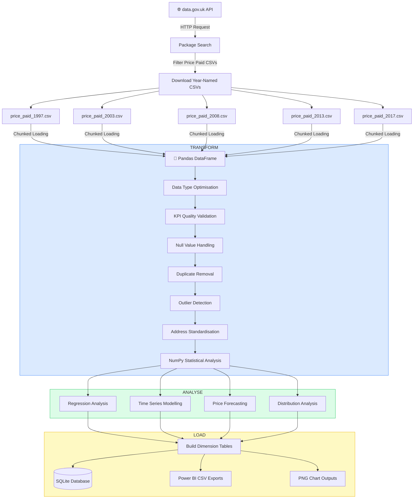
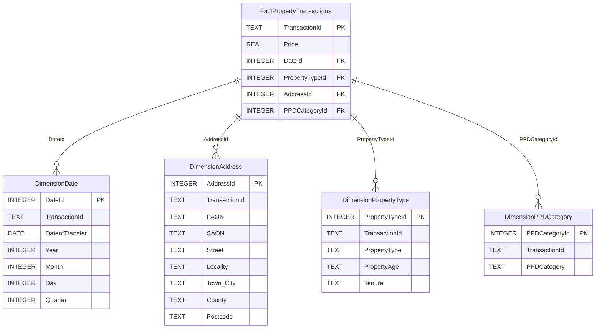

# 🏠 UK Property Market Analysis Pipeline
### Land Registry Price Paid Data | 1997 - 2017

---

## 📋 Project Overview

An end-to-end data engineering and analytics pipeline built to extract, 
transform, analyse and load UK residential property transaction data 
from the HM Land Registry Price Paid dataset.

The project covers 20 years of property market data (1997-2017) across 
5 key market periods, implementing statistical analysis, regression 
modelling and time series forecasting to identify market trends and 
quantify relationships between property investment drivers.

---

## 🎯 Key Findings

- **275% price growth** between 1997 and 2017
  - 1997 median price: £60,000
  - 2017 median price: £225,000

- **Annual growth rate** of ~5.9% per year (regression coefficient)

- **Property type impact** on price (strongest to weakest):
  - Detached → Semi-Detached → Terraced → Flat

- **Freehold premium** of ~27.6% over leasehold properties

- **New build premium** of ~12% over existing properties

- **Growing market inequality** - price spread between cheap 
  and expensive properties widened every year 1997-2017

- **Regression R² of 0.35** using property type, tenure, 
  age and year - location accounts for remaining variance

---

## 🔄 Pipeline Architecture

## 🗄️ Database Schema

> **Note:** This project was originally designed and implemented using 
> **Azure SQL Database and Azure Synapse Analytics** for cloud-scale 
> data storage and processing. Due to Azure free credit limitations 
> during development, the database layer was migrated to **SQLite** 
> as a lightweight local alternative, while maintaining the same 
> star schema design, SQL logic and table structure throughout.

## 📊 Analysis Results

### Statistical Summary

| Metric | Value |
|---|---|
| Total Records Analysed | ~349,000 |
| Years Covered | 1997, 2003, 2008, 2013, 2017 |
| Mean Price | £237,375 |
| Median Price | £162,000 |
| Price Range | £5,000 - £10,000,000 |
| Outliers Removed | < 0.5% |

### Year on Year Median Prices

| Year | Median Price | Growth |
|---|---|---|
| 1997 | £60,000 | Baseline |
| 2003 | £130,000 | +116.7% |
| 2008 | £170,000 | +30.8% |
| 2013 | £184,000 | +8.2% |
| 2017 | £225,000 | +22.3% |

### Regression Model Performance

| Metric | Value |
|---|---|
| Model | Linear Regression |
| Target Variable | Log(Price) |
| Features | Property Type, Tenure, Age, Year |
| R² Score | 0.3541 |
| Training Samples | 279,204 |
| Testing Samples | 69,802 |

### Data Quality Report

| Check | Result |
|---|---|
| Duplicate Transactions | 19,265 removed (part file overlaps) |
| Missing Postcodes | Removed |
| Price Errors (< £5K) | Removed |
| Extreme Outliers (> £10M) | Removed |
| Final Data Quality | ✅ PASS |

---
## 🔮 Future Improvements

> **Note:** This project was originally designed and implemented using 
> **Azure SQL Database and Azure Synapse Analytics** for cloud-scale 
> data storage and processing. Due to Azure free credit limitations 
> during development, the database layer was migrated to **SQLite** 
> as a lightweight local alternative, while maintaining the same 
> star schema design, SQL logic and table structure throughout.

- [ ] Extend to 2018-2024 data when available
- [ ] Restore Azure SQL Database connection when credits available
- [ ] Re-deploy pipeline to Azure Synapse Analytics
- [ ] Migrate SQLite star schema back to Azure cloud environment
- [ ] Implement PySpark for distributed processing
- [ ] Add Random Forest model to improve R² score
- [ ] Include postcode-level geographic analysis
- [ ] Add automated pipeline scheduling
- [ ] Deploy to Azure Databricks

Source: data.gov.uk
API: https://data.gov.uk/api/action/package_search
Coverage: England and Wales residential properties
Licence: Open Government Licence v3.0
Contains HM Land Registry data © Crown copyright and database right 2024.
This data is licensed under the Open Government Licence v3.0.

Built as part of a data engineering portfolio project
demonstrating end-to-end ETL pipeline development,
statistical analysis and machine learning on real
government property transaction data.
